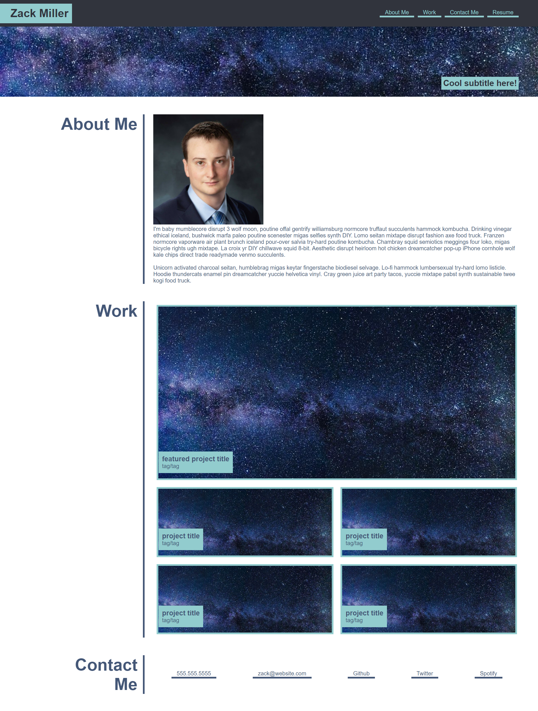
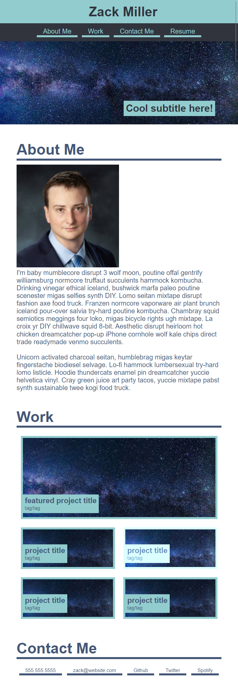

# zacktmiller92.github.io

## Overview

I am a student at Rutgers studying Full Stack Webdevelopment. 

This website has been estableshed to serve as a portfolio for my classwork. 

Connect with me on LinkedIn to see my work experience, or view my github site to see my class projects.

## Links

[LinkedIn](https://www.linkedin.com/in/zack-miller/)

[Class Portfolio](https://zacktmiller92.github.io/)

## Project Screenshots
### Desktop Screenshot:

### Mobile Screenshot:

